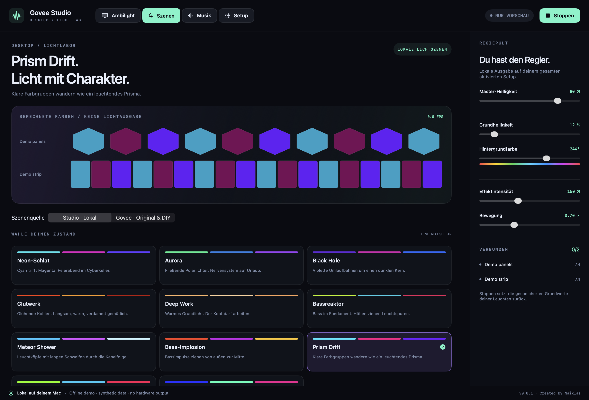
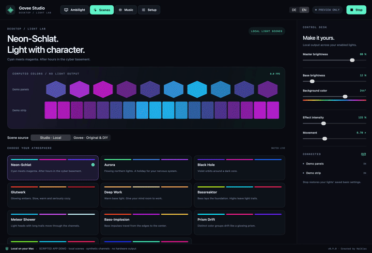
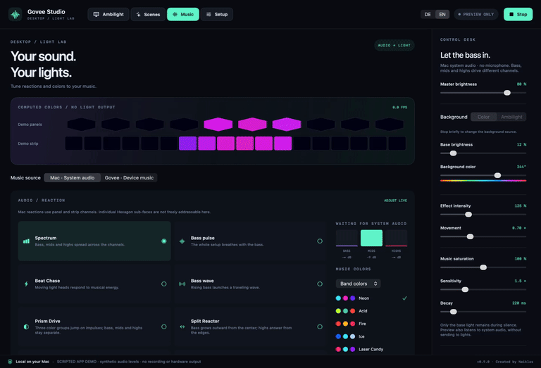
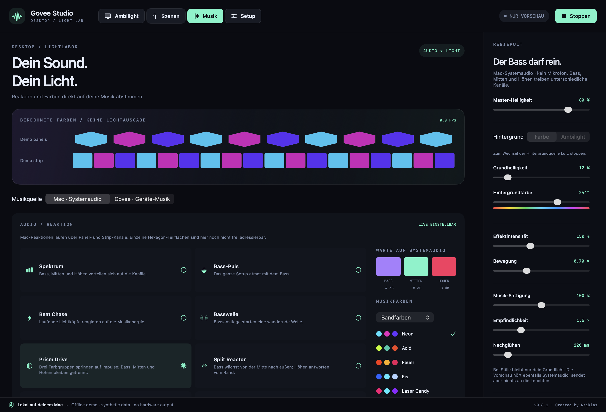
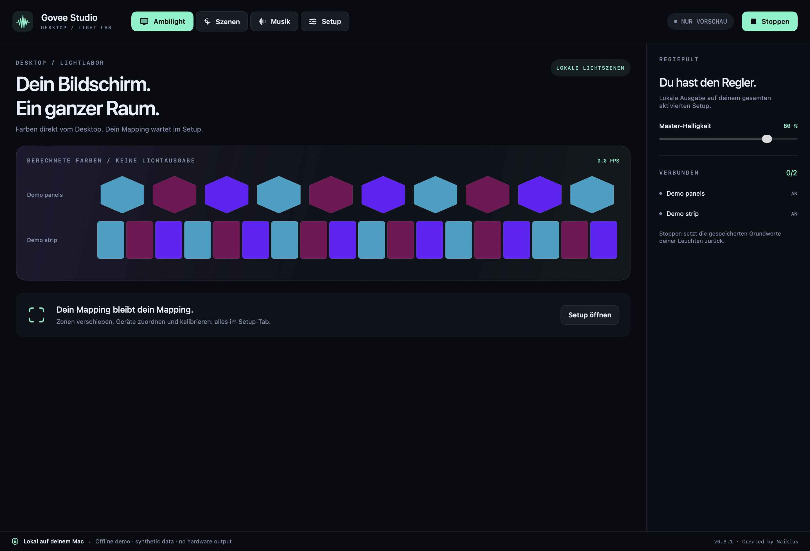

# Govee Studio

**Your screen. Your sound. Your lights.**

A native macOS light studio for desktop Ambilight, local scenes and music-reactive lighting with compatible Govee devices. Built with SwiftUI, ScreenCaptureKit and direct LAN output.

Created by **Naiklas**. Born in a personal light lab, with a little Neon-Schlat left in its DNA.

> Independent community project. Not developed, endorsed or certified by Govee. Currently a private project with no open-source license granted.



*Actual SwiftUI interface rendered offline with synthetic devices. The app UI is currently German; this documentation is English. These are not photos of physical lights.*

## See it move

| Local scene: Prism Drift | Music reaction: Prism Drive |
| --- | --- |
|  |  |

Six-second, silent clips rendered using the project's own local effect engine. Channels and audio levels are synthetic; these are **engine demonstrations, not hardware recordings**. No commercial songs, third-party videos or Govee vendor animations are included.

Download the MP4 versions: [Prism Drift](docs/media/prism-drift.mp4) · [Prism Drive](docs/media/music-reactor.mp4). See [media provenance](docs/media/README.md) for sources and reproduction.

## Features

- **Ambilight:** map screen regions to panels and strip segments; adjust brightness, saturation, smoothing and black-bar handling.
- **Setup editor:** drag and resize zones, select multiple zones, move groups, test segment order and save profiles.
- **Local scenes:** eleven looks, including Aurora, Glutwerk, Prism Drift and Liquid Chrome, with independent base color, movement and intensity.
- **Mac music:** eight reactions and ten palettes driven by bass, mids, highs and audio onsets. Add Ambilight as an independently adjustable background.
- **Govee device music:** native music modes across the room, with sensitivity, brightness and coordinated colors. Compatible Hexagons can use the vendor's built-in multi-face effects.
- **Original and DIY scenes:** browse device catalogs, control a single light, or select an original effect for each device and start the whole room with one button.
- **Split room output:** for example, device music on Hexagons and Ambilight on strips. Each device has exactly one output source.

<details>
<summary>More interface screenshots</summary>

### Mac music



### Ambilight



These offline renders contain no real device identifiers, desktop capture or live audio. A zero frame-rate readout and disconnected devices are expected in the offline renderer.

</details>

## Requirements

- macOS 14+ as declared by the build. Hardware validation was performed on Apple Silicon with macOS 26; older systems and Intel Macs have not been verified.
- Full Xcode with Swift 6+ to build from source. The package currently uses Swift 5 language mode.
- Compatible Govee lights with **LAN Control** enabled in Govee Home, reachable from your Mac.
- **No API key required** for local Ambilight, scenes or Mac music.
- Optional: your own Govee API key and internet access for original/DIY effects and native device-music control.

## Build and run

From the cloned repository:

```sh
./scripts/test.sh
./scripts/build-app.sh --install
open "$HOME/Applications/Govee Studio.app"
```

The script prefers `/Applications/Xcode.app` without changing global `xcode-select` settings. It installs to `~/Applications` and packages `dist/Govee-Studio.zip`. Omit `--install` to build and package only.

Builds are locally ad-hoc signed, not notarized or distributed through the App Store. The script builds for the host Mac's architecture, not a universal binary. Private configuration files are never copied into the bundle.

## First-time setup

1. Enable **LAN Control** for each light in Govee Home. The Mac and lights must be able to reach each other.
2. Open **Setup → Geräte suchen** (Find devices). Allow local network access if macOS asks.
3. For Ambilight or Mac system audio, grant the macOS screen/system-audio recording permission. Restart the app if prompted.
4. Select your display and lights. Place sampling zones over the desired screen regions. Control-click enables multi-selection.
5. Verify segment count and order using the short segment test. Defaults are starting points, not automatic hardware calibration.
6. Choose **Ambilight**, **Szenen** (Scenes) or **Musik** (Music) and start output. **Stoppen** (Stop), or `⌘.`, stops output and sends the saved basic light state back.

Settings save automatically. Named profiles preserve mappings and light parameters. **Vorschau** (Preview) runs without light output. The app excludes its own windows from screen capture.

### Original effects and device music

Enter your own API key in a Govee section. **Dauerhaft speichern** (Save permanently) stores it in macOS Keychain and loads it on later launches. Then use **Katalog aktualisieren** (Refresh catalog) or **Musikmodi abrufen** (Fetch music modes).

Under **Szenen → Govee · Original & DIY → Ganzer Raum · Original**, select an original effect for every enabled light, then start the room. Every command uses the selected device's own scene ID. Single-device and DIY controls remain available separately.

**Mac · Systemaudio** and **Govee · Geräte-Musik** are different engines. Govee's native music modes react at the device; they do not receive a Mac audio stream. Their ongoing reaction does not require a continuous cloud stream. Starting a mode and changing sensitivity or colors uses cloud commands; brightness-only adjustments use LAN.

## Compatibility and limitations

| Model | Verified so far |
| --- | --- |
| H606A / Hexagon Ultra | LAN colors, local channel streaming, original effects and internal multi-face music reactions |
| H61A0 / Neon Rope Light | LAN colors, local channel streaming and internal music reaction |
| H61A2 / Neon Rope Light | LAN colors, local channel streaming and internal music reaction |

This describes past tests, not a guarantee for every firmware or effect. Unknown models default to one zone and whole-device output. Verify segment counts yourself.

- Arbitrary H606A inner/outer or sub-face control through the local engine is unresolved. Native multi-face effects are supplied by Govee's internal modes.
- Queried native music capabilities expose no separate speed, decay or minimum background-light controls.
- Native device music and Ambilight can run on different lights, not be layered on the same light.
- Cloud commands are sequential. A room start does not provide frame-synchronized animation.
- Stop restores basic power, color, color temperature and brightness. A previous vendor animation cannot be reconstructed from those values.
- Cloud acknowledgements and successful UDP sends do not prove visible light output. Hardware tests require visual inspection.

## Privacy and local data

Screen frames and Mac audio are processed locally for light calculation. The app does not save recordings or upload them. Optional Govee integration sends device identifiers and control commands to Govee's official API.

`~/Library/Application Support/GoveeStudio/` contains private device addresses, layouts, profiles, catalogs, room choices and recovery data. **Do not commit these files.** The API key is stored separately in macOS Keychain, not in JSON, source code or the app bundle.

Build output and diagnostics under `.build/`, `dist/` and `.local/` are ignored. Run `python3 scripts/check-publication.py` before committing. Documentation media is generated offline from synthetic data, reviewed and listed by checksum in its provenance manifest.

## Troubleshooting

- Check LAN Control, macOS network permission and reachability. Guest networks and client isolation can separate your devices.
- Close other light controllers. The local app uses UDP port 4002 for replies.
- Test whole-device colors before segment streaming. LAN support does not imply support for the same streaming protocol.
- If recovery is pending, make the devices reachable and complete restoration. Do not discard recovery data prematurely.
- For cloud errors, check the key and internet connection. Retry later if rate-limited.

More detail: [Architecture and verification](docs/VERIFICATION.md) · [Contributing](CONTRIBUTING.md) · [Security and private reports](SECURITY.md).

## Interface references

- [Apple ScreenCaptureKit](https://developer.apple.com/documentation/screencapturekit)
- [Govee LAN API](https://app-h5.govee.com/user-manual/wlan-guide)
- [Govee Developer API](https://developer.govee.com/)
- [LedFx Govee implementation](https://github.com/LedFx/LedFx/blob/main/ledfx/devices/govee.py)
- [GoveeDreamView](https://github.com/LeoSko/GoveeDreamView)

No project license has been chosen. Public release and licensing remain separate decisions.
